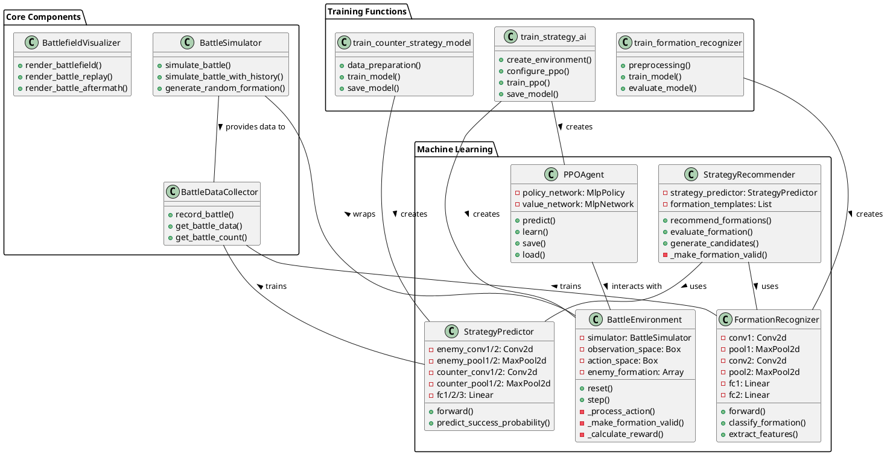
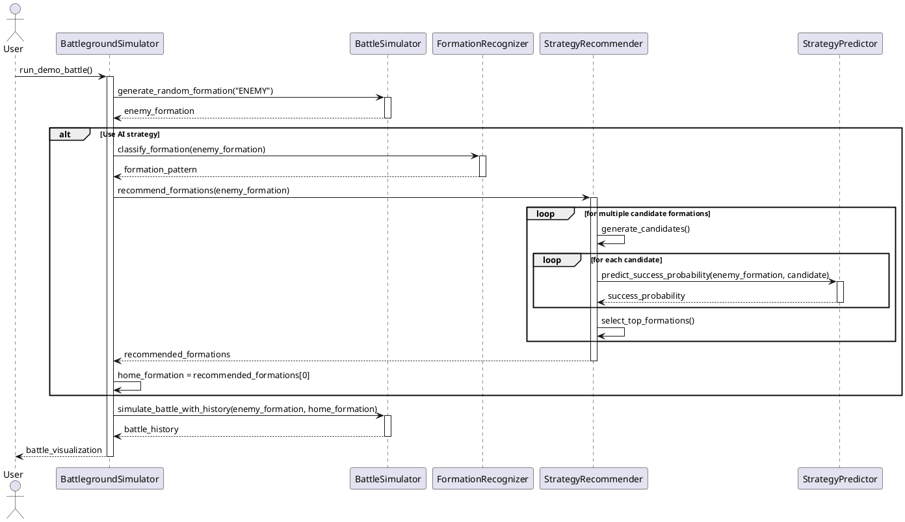
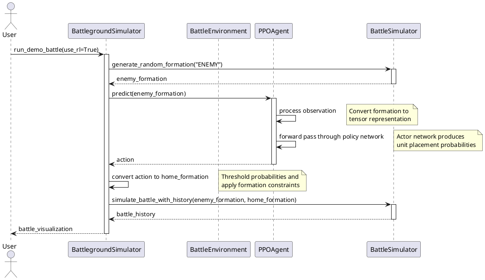
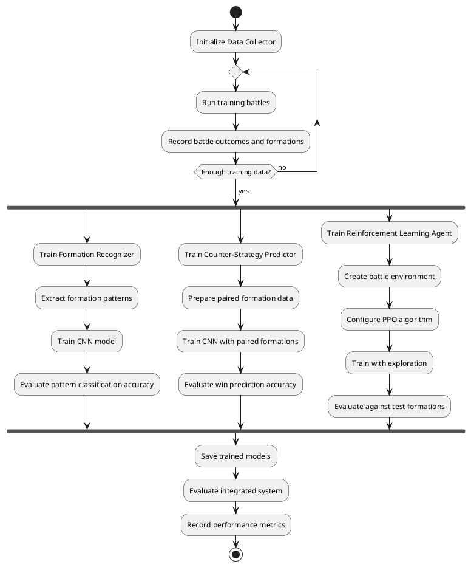
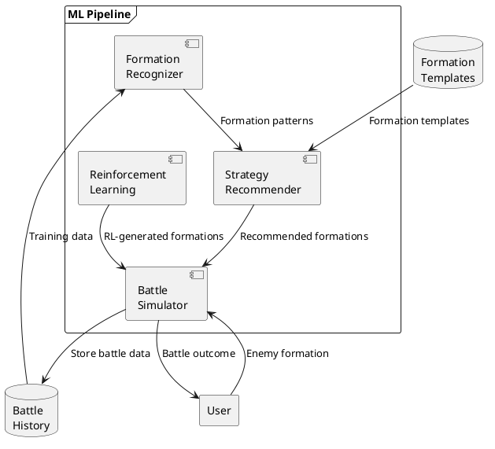
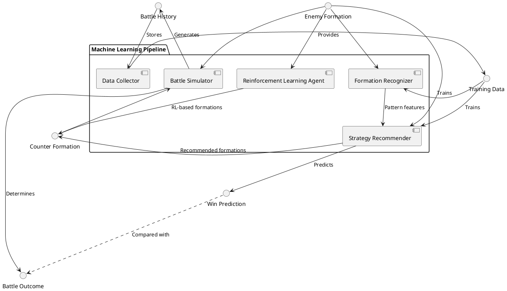
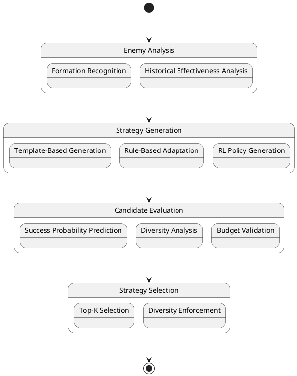
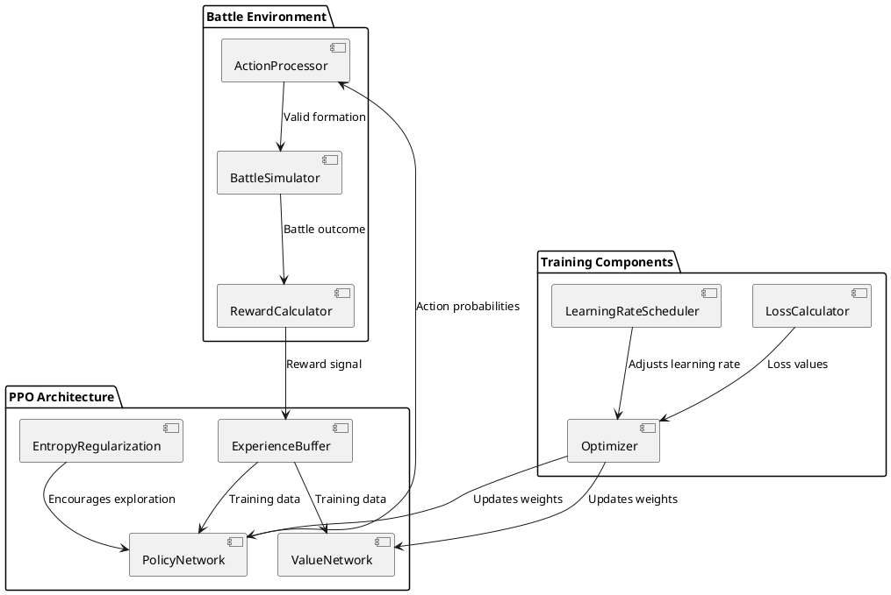
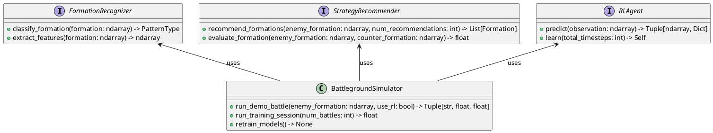

# Machine Learning UML Diagrams for Battleground Simulator

This file contains PlantUML code for visualizing the machine learning architecture of the Battleground Simulator.

## Class Diagram

## Sequence Diagram: Formation Recognition and Strategy Recommendation

## Sequence Diagram: Reinforcement Learning Workflow

## Training Process Diagram

## Data Flow Diagram

## Component Interaction Diagram

## ML Decision Process

## Reinforcement Learning Architecture

## Model Interface Diagram

These UML diagrams provide a comprehensive visualization of the machine learning components and their interactions in the Battleground Simulator. 